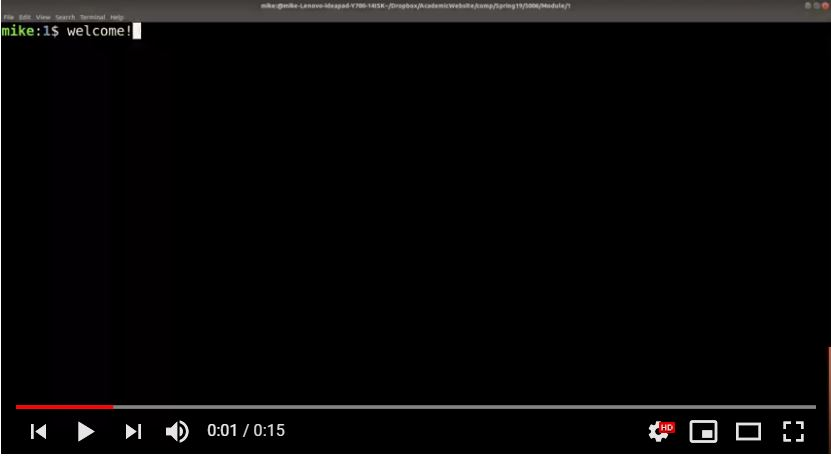
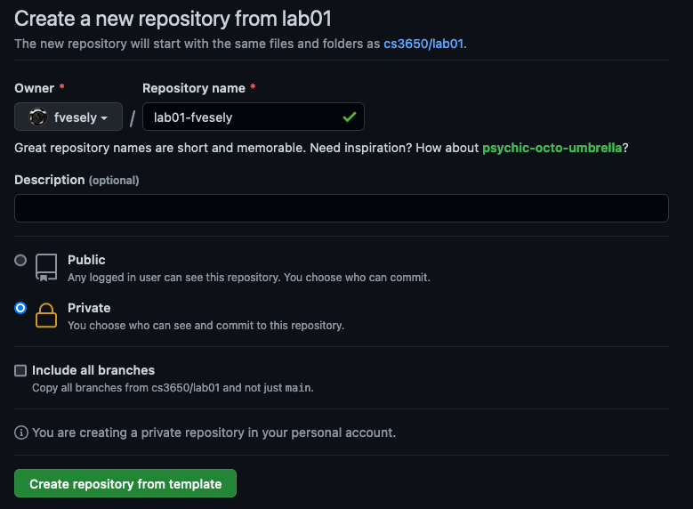

# Terminal Overview

Welcome to the first lab! The purpose of this lab is to set up a working environment and get some practice working at the command line. 

In this lab, you are going to perform a few terminal commands to get familiar with the Unix Environment along with some other standard tools used throughout this course (and that you will use in your career!).

<!--
# Video tutorial of Lab 1

For this first lab, Professor Mike Shah developed a video tutorial because there can be so many new tools/infrastructure being introduced you may become overwhelmed! However, try your best to work through the lab during class time, but if you get stuck you can follow along the video later on. 

Remember, labs are due at 11:59 PM on the Thursday before class the following week--so you get one week to submit your lab. Even if you work in assigned groups, everyone should  make individual submissions.

[Tutorial playlist starts here!](https://www.youtube.com/watch?v=HjZVOWAGgZQ&list=PLvv0ScY6vfd8qupx0owF78ZcbvySvbWfx)
 (Note the tutorial is for all levels of my systems courses--ignore the course numbers!)


-->

## Part 0 - Log in to Khoury's Github Enterprise and obtain the lab repository

1. Go to <https://github.khoury.northeastern.edu/> and log in with your Khoury username.
  - If, for some reason, you do not have a Khoury username (or can not remember your username or password), [follow these instructions](https://www.khoury.northeastern.edu/systems/getting-started/)

2. Go to <https://github.khoury.northeastern.edu/cs3650/lab01> and click *Use this template*
   
   - In the form, put `lab01-[khoury_user_name]` as the name of the repository, replacing `[khoury_user_name]` with your username.
   - Set the **Owner** to your [khoury_user_name]
   - Make sure that the repository is private
   - See image below

   

2. Run through the following github tutorial if you are not familiar with git.
  - <https://guides.github.com/introduction/git-handbook/>
  - This is worth the 15 minutes it takes to avoid headaches later on!
  - Video guides if needed: [https://www.youtube.com/githubguides](https://www.youtube.com/githubguides)

## Part 1 - SSH

In this class, we will program on Linux on an x86_64 architecture, the 64-bit version of the x86 instruction set.  `login.khoury.northeastern.edu` has that architecture and runs Linux.  We'll use SSH to connect to `login.khoury.northeastern.edu` and other remote systems this semester.  Being able to use SSH and work in a remote command line environment are part of the basic skills you will master in this course. 

First, you need to make sure you have an SSH client available on your computer.

### ssh clients for each operating system

* For Windows Users, installing PuTTY is sufficient. [https://www.putty.org/](https://www.putty.org/)
  * One option is to use PowerShell.  It includes a ssh client.
  * Another option is to use/install Windows Subsystem for Linux (WSL), which comes with a Bash shell and an SSH client. <https://docs.microsoft.com/en-us/windows/wsl/install-win10>
    
    The advantage of this solution is that it will give you a Linux development environment directly in Windows. Note that not all what we'll do in this class is compatable in this environment and you must still test your work on our supported course systems, e.g., `login.khoury.northeastern.edu`, before submitting.
* For Linux/Mac users, you already have a terminal and an SSH client available! Just search for the 'terminal' application.
* We additionally will install a virtual machine which you may work from, and which has a terminal from which you can ssh from.

### ssh'ing

Once your terminal is open, 'ssh' into Khoury with: 

```
$ ssh [khoury_user_name]@login.khoury.northeastern.edu
```
where you replace `[khoury_user_name]` with the username of your Khoury account, e.g. if "xyzzy" is your Khoury account username, then
```
$ ssh xyzzy@login.khoury.northeastern.edu
```

The server should then prompt you for your password.

---

 **Warning:** If you enter the wrong password 3 times, the login server will block you. So, if you have already typed the wrong password two times, press Ctrl-C to cancel the login process and reset your Khoury password to make sure you know what it is exactly. Then try ssh'ing again. See <https://service.northeastern.edu/tech?id=kb_article_view&sysparm_article=KB0012073&sys_kb_id=775e12c4db5ad41062cdf9051d961941&spa=1>

---

If, for some reason, you do not have a Khoury username, [follow these instructions](https://www.khoury.northeastern.edu/systems/getting-started/).

After you have successfully ssh'd, you are now running programs on the Khoury servers (i.e. not locally on your machine).

If you are using PuTTY, follow the instructions for entering the server name (`login.khoury.northeastern.edu`) and your username.


## Part 1.5 - Obtaining your repo (i.e. cloning your repository)

When you have successfully ssh'd into your remote account (Part 1) you should download a copy of your repository on the Khoury servers. Before you'll be able to do that, you need to generate an SSH key for yourself. Once you create an SSH key, you can add it to your Khoury Login account. The full process is described on Github <https://docs.github.com/en/authentication/connecting-to-github-with-ssh/generating-a-new-ssh-key-and-adding-it-to-the-ssh-agent>, here we give the main steps.

### Generating a new SSH key

When logged in via SSH to Khoury Login, run the following command:

```
$ ssh-keygen -t ed25519 -C "your_myneu_name@northeastern.edu"
```

You will be asked which file you want to save the key to. The default should be fine, so just press Enter.

Next, you will be asked to pick a passphrase. Choose something secure, but make sure you remember it for later. Confirm the passphrase you picked.

Your whole interaction might look something like this:

```
-bash-4.2$ ssh-keygen -t ed25519 -C "your.username@northeastern.edu"
Generating public/private ed25519 key pair.
Enter file in which to save the key (/home/fvesely/.ssh/id_ed25519): 
Created directory '/home/fvesely/.ssh'.
Enter passphrase (empty for no passphrase): 
Enter same passphrase again: 
Your identification has been saved in /home/fvesely/.ssh/id_ed25519.
Your public key has been saved in /home/fvesely/.ssh/id_ed25519.pub.
The key fingerprint is:
SHA256:I3ibRo4M+9uLh52BAk/6ftoPWxggMRJ/afd3f7fLLxI your.username@northeastern.edu
The key's randomart image is:
+--[ED25519 256]--+
|=.               |
|.+   .           |
|. o + .          |
|...+ o .         |
| =. o.+ S . .    |
|. o+.B.+ o .E.   |
| ...=o*o     .. o|
|  .ooB+     . o.o|
| .oo*++.     . =+|
+----[SHA256]-----+
-bash-4.2$
```

This step has generated a public & private key pair in the `.ssh` directory. You can check that this is the case by using the `ls` command (more below):

```
-bash-4.2$ ls ~/.ssh
id_ed25519  id_ed25519.pub
```

Finally, open the file `~/.bashrc` in a text editor and add the following lines to the end:

```
SSH_ENV="$HOME/.ssh/agent-environment"

function start_agent {
    echo "Initialising new SSH agent..."
    /usr/bin/ssh-agent | sed 's/^echo/#echo/' > "${SSH_ENV}"
    echo succeeded
    chmod 600 "${SSH_ENV}"
    . "${SSH_ENV}" > /dev/null
}

# Source SSH settings, if applicable

if [ -f "${SSH_ENV}" ]; then
    . "${SSH_ENV}" > /dev/null
    #ps ${SSH_AGENT_PID} doesn't work under cywgin
    ps -ef | grep ${SSH_AGENT_PID} | grep ssh-agent$ > /dev/null || {
        start_agent;
    }
else
    start_agent;
fi
```

Then run the following commands:

```
-bash-4.2$ source ~/.bashrc
-bash-4.2$ ssh-add
```

In the last step, enter your chosen passphrase. These last 3 commands will ensure that your ssh key is available when it's needed. 

Next time you log in, you only need to run `ssh-add` again.

### Adding your SSH key to Github

This part is covered in <https://docs.github.com/en/authentication/connecting-to-github-with-ssh/adding-a-new-ssh-key-to-your-github-account>.

You will need to figure out how to copy text from your terminal or PuTTY. Selecting with the mouse pointer and using Ctrl-C works most of the time. Print the contents of the file `~/.ssh/id_ed25519.pub`, e.g.,:

```
-bash-4.2$ cat ~/.ssh/id_ed25519.pub
```

Select and copy the contents of the file. Log in to your Github account, click on your profile photo in the upper right corner of the page, and go to *Settings*.

Click on *SSH and GPG keys*, then *New SSH key*. 

In the *Title* field, give your new key a name, e.g. "Khoury Login Key".

Paste the text from the `id_ed25519.pub` file into the *Key* field.

Click *Add SSH key*. You might need to enter your GitHub password.

### Cloning your repo

Go back to your terminal with ssh running.

1. Run `git clone your_repository_spec` to establish a git repository on your system. *your_repository_spec* is found by clicking the 'green' button on your Lab 1 repository page and selecting 'SSH'.

   It should look something like `git@github.khoury.northeastern.edu:[khoury_user_name]/lab01-[khoury_user_name].git`.

	 This step will create a local *working directory* with the contents of the repository.
	
2. When you make a change to a file within this directory you can see what is different by running `git status` to see what you have changed locally on your computer. Changes you have made locally have not yet been saved to Github's servers. You can also see the changes in more detail by running `git diff`.

3. When you are happy with your changes do `git add [whatever_file_was_changed]` which prepares that specific file to be added to the master. See the [git add documentation](https://git-scm.com/docs/git-add).

4. Next, you will do `git commit -m "some informative message about your changes"` to record changes in your repository See the [git commit documentation](https://git-scm.com/docs/git-commit). For the future, you might want to learn [how to write *good* commit messages](https://chris.beams.io/posts/git-commit/).

5. Finally, do a `git push` to actually make things happen--meaning everything you have added will go to the Github server. You can check your github.com repository to see exactly what I will see. See the [git push documentation](https://git-scm.com/docs/git-push).


|              |
| ------------ |
| This [Git Cheat Sheet](https://education.github.com/git-cheat-sheet-education.pdf) might be helpful when learning Git. |


## Part 2 - The (at least) 10 Commands

Try running the following commands (See deliverables section at the end for copying and pasting to [output.txt](./output.txt)).

1. [ls](http://man7.org/linux/man-pages/man1/ls.1.html) - lists the files and folders in the current directory.
2. [pwd](https://linux.die.net/man/1/pwd) - Echos (i.e. prints) the current directory you are in to the terminal
3. [mkdir](http://man7.org/linux/man-pages/man2/mkdir.2.html) - Create a new directory
4. [rmdir](http://man7.org/linux/man-pages/man2/rmdir.2.html) - Removes an empty directory
5. [cd](http://man7.org/linux/man-pages/man1/cd.1p.html) - Change directory
6. [mv](https://linux.die.net/man/1/mv) - Allows you to move a file elsewhere (sometimes I use this to rename a file)
7. [cp](http://man7.org/linux/man-pages/man1/cp.1.html) - Copies a file
8. [touch](https://linux.die.net/man/1/touch) - Typically I use to create a new empty file that does not exist.
9. [man](http://man7.org/linux/man-pages/man1/man.1.html) - Manual pages
10. [ps](http://man7.org/linux/man-pages/man1/ps.1.html) - Shows which processes are running
11. [echo](https://linux.die.net/man/1/echo) - Prints out a line of text.
12. [whoami](https://linux.die.net/man/1/whoami) - Prints which user you are logged in as.
13. [sort](http://man7.org/linux/man-pages/man1/sort.1.html) - Sorts information
14. [cat](http://man7.org/linux/man-pages/man1/cat.1.html) - Concatenates files and prints them to standard output
15. [nl](http://man7.org/linux/man-pages/man1/nl.1.html) - Outputs a file with number of lines
16. [cut](http://man7.org/linux/man-pages/man1/cut.1.html) - Remove sections from each file
17. [grep](http://man7.org/linux/man-pages/man1/grep.1.html) - Prints lines that match a pattern. This is a very powerful serach command.
18. Other interesting commands/programs include: [cut](https://linux.die.net/man/1/cut), [sed](https://linux.die.net/man/1/sed), [awk](https://linux.die.net/man/1/awk), [locate](https://linux.die.net/man/1/locate), [clear](https://linux.die.net/man/1/clear)

*Note from instructor:* I included urls to the commands above, but it will almost always be faster for you to search the man pages within your terminal (and if you do not have terminal access, you will want to use the web version anyway).

## Navigating the terminal quickly (Read and try each)

Here are some other nice things to know with the terminal.

* Pressing the up-arrow and down-arrow keys iterates through your command history (There is also a commmand called *history* you can checkout).
* Pressing *tab* autocompletes if it finds a program, command, or file path.
	* Start typing `mkdi` then hit `tab`
	* `tab` can also auto-complete filenames and filepaths, this can be especially helpful!
* Pressing Ctrl+C sends a signal to the terminal to terminate a program if it gets stuck.
	* Type: `grep .` Then press `Ctrl+C` to terminate.
* Pressing Ctrl+Z sends a signal to the terminal to suspend a program and give you back control.
  * You can play with this command by typing in *sleep 10* (which puts the terminal to sleep) for 10 seconds, and see how you can terminate this program.
* Practice getting help by typing `man ssh` into the terminal. (Press q to quit the manual pages).

## A bit of precision
Calling each of these 'commands' (i.e. ls, sort, cat, etc.) is not really correct. Each of these is itself a program (typically implemented in C or some other language).

As an example, here is the source code for 'ls': <http://git.savannah.gnu.org/cgit/coreutils.git/tree/src/ls.c>
Each of these commands are part of the coreutils package in Unix. If you look through the source tree, you will additionally find many other programs (i.e. terminal commands you run in your shell) here: <http://git.savannah.gnu.org/cgit/coreutils.git/tree/src/>.


# Part 3 - Get comfortable with an editor and the C compiler

Compile the program `hello.c` using `gcc` to get an executable named `hello` (Hint: look for the option -o in the gcc manual). Make sure it runs and prints what you expect.

Now open your terminal editor (vim, Emacs, nano, joe, ...) and modify the program so it prints: your first name followed by a newline and your email address followed by a newline.

Recompile the program and make sure it runs. Commit and push the file to your Github repository.

Take a look at the first few sections of the [Learn C](https://www.learn-c.org/) tutorial. Make the program print your name and email address 20 times using a for loop. Recompile and run. Commit and push the file to your Github repository.

Here is a little tutorial on VIM as a resource: [https://www.howtoforge.com/vim-basics](https://www.howtoforge.com/vim-basics).

Here is a [Vim Basics in 8 Minutes](https://www.youtube.com/watch?v=ggSyF1SVFr4) video.

Here's a tutorial for `nano`: <https://www.howtogeek.com/howto/42980/the-beginners-guide-to-nano-the-linux-command-line-text-editor/>

**Note:** You are not required to use the same terminal editor I use (I'm a VIM user), but you should become comfortable using at least one terminal editor in this course and we recommend either VIM or Emacs, both powerful highly customizable editors with huge user bases. In general, it is good to have at least basic knowledge of VIM, since some version of it is installed by default on virtually any Unix/Unix-like system.

<!--## Deliverables

* Copy and Paste the output from the command-line interface of you running five different terminal commands above into a file called [output.txt](./output.txt) (no capitalization, exactly as named.)
  * Make sure to 'add/commit/push' this file to the repo in this directory.
* Modify the file called [hello.c](./hello.c) in your repository as instructed above.
  * Make sure to 'add/commit/push' this file to the repo in this directory.
  * DO NOT add or commit the executible **hello**.
* Take a screenshot of your virtual environment running. Name it `linux.jpg` (or `linux.png`)
  * Make sure to 'add/commit/push' this file to the repo in this directory.
* Complete the "Lab 1 Quiz" on Canvas. This quiz will also ask you to upload some of the above files.-->

## Going Further

Khoury Systems offers some resources for learning linux: <https://service.northeastern.edu/tech?id=kb_article_view&sysparm_article=KB0012107&sys_kb_id=1bec8312db16905062cdf9051d9619a2&spa=1>

Some more terminal programs to research and try out on your own time:

1. [history](http://man7.org/linux/man-pages/man3/history.3.html)
2. [tree](https://linux.die.net/man/1/tree)
3. [scp](https://linux.die.net/man/1/scp)
	- Copy a file(e.g. backup_copy.txt) from a remote host(i.e. a server) to a local host(i.e. your machine)
		- `scp username@from_host:backup_copy.txt /mike/desktop/`
	- Copy file(e.g. linux.jpg) from local host(i.e. your machine) to a remote host (i.e. a server)
		- `scp linux.jpg username@to_host:/remote/directory/`
