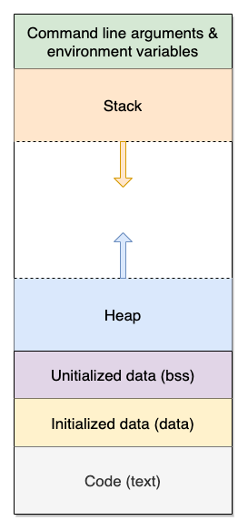

# C Data Structures, Valgrind, and Linked Lists  

<!--  --->

## Introduction

Today we're going to work our way towards creating linked lists in C. Your actual task is in Parts 4 and 5, but do copy and paste the examples, try to compile them, and, time permitting, practice using gdb.

## Data Structures in C

### Static Arrays

We introduced arrays in the last lecture. As a reminder, an array is a data structure which stores homogenous data in a contiguous piece of memory. For example:

```c
int array_of_ints[100];            // This array holds strictly integers.
unsigned int array_of_uints[100];  // This array holds strictly unsigned ints.
float array_of_floats[100];        // This array holds strictly floats.
```

Arrays can be *statically allocated*. That is, at compile-time (before a program is run), we know exactly how much memory is required to store the contents of the array in memory.

Here are some examples of statically allocated arrays:
```c
int numbers[10];             // 'numbers' is large enough to store exactly 10 integers (10 integers * 4 bytes = 40 bytes).
char firstName[15];          // 'firstName' stores up to 15 char's (15 chars * 1 byte per char = 15 bytes)
float decimalNumbers[5000];  // 'decimalNumbers' holds up to 5000 floating point numbers.
```

Again, the *statically allocated* portion means that there is a fixed number of elements in the arrays. This value is decided when we write our source code and compile it at compile-time. We cannot extend a statically allocated array at runtime.




### Dynamically Allocated Arrays with malloc and free


Often however, we may not know how many elements we want to store in an array. We will only know how big to make the array while the program is running--that is at *run-time* we set the size of the array. [malloc](http://man7.org/linux/man-pages/man3/malloc.3.html) is the C-library function (included in the [`stdlib.h`](https://www.cplusplus.com/reference/cstdlib/) *header* file) that allows us to do this. Here's `malloc`'s signature:

```c
void *malloc (size_t size);
```

`malloc` takes the number of bytes to allocate and, if successful, returns a *pointer* to a chunk of memory with that size. This memory comes from the *heap* area. Note that the type of pointer `malloc` returns is a pointer to `void`. Void is a type that has no size -- you cannot allocate variables of type void, but you can create pointers to them! To actually get the type of pointer we want, we [type cast](https://www.tutorialspoint.com/cprogramming/c_type_casting.htm) the pointer to `void` to a pointer to `the desired type`.

`free` is the opposite of `malloc`: given a pointer to a chunk of memory allocated using `malloc`, it releases the memory to the OS. Not freeing `malloc`'d memory results in [*memory leaks*](https://en.wikipedia.org/wiki/Memory_leak). **Always free your dynamically allocated memory.**


Here is an example of `malloc` and `free` at work.

```c
#include <stdio.h>
#include <stdlib.h> // includes malloc/free


int main(int argc, char **argv) {

    int array_size = 0;
    printf("How many elements would you like in your array? ");
    scanf("%d", &array_size);

    // Create our array at run-time.
    // We are allocating this array in heap memory.
    // Heap memory 'persists' until we 'free' the memory.
    //
    // Note we do not know the 'array_size' until
    // we read the user input. This is useful, because
    // we may not know the size of a dataset for examlple.
    int *my_array = (int *) malloc(sizeof(int) * array_size);

    if (!my_array) {
      fprintf(stderr, "Error: could not allocate memory!\n");
      return 1;
    }

    // Initialize our array items, for now a simple loop.
    for(int i = 0; i < array_size; ++i){
        // Access each element in the array.
        my_array[i] = i * i;
        printf("my_array[%d] = %d\n", i, my_array[i]);
    }

    // The free function reclaims any memory we have
    // allocated on the heap.
    free(my_array);

    return 0;
}
```

Note, that we are using the `sizeof` operator to figure out how much memory a single element will take.

#### `malloc`'s friends

The standard library header `stdlib.h` contains two further functions commonly used to dynamically allocate memory: `calloc` and `realloc`. Read up on them on their [man page](https://linux.die.net/man/3/calloc).


### Dynamic data structures

One tricky thing with dynamically allocated arrays however, is that if we have to expand or reduce the size of them, this involves having to allocate a new array, and then copy the elements over one at a time. This can be expensive in terms of performance if we have to do this frequently. For this problem, a data structure that can expand and contract more incrementally can be very efficient in terms of time and space (efficiency is important as we only have a finite amount of memory on our computers).

For today's lab, we will be implementing a data structure known as the **singly linked list** that can expand or contract one item at a time. This exercise will give you practice with:

1. struct's
2. pointers
<!--3. file I/O
4. Connecting our previous work with bash scripts to C programs-->

# Part 1 - Understanding a struct - Creating Custom Data Types

A struct is a user defined data type (i.e. it does not exist natively in C) that stores multiple pieces of data. We call this a composite data type. It is similar to Java's classes (but without methods or access control) or [`define-struct`](https://docs.racket-lang.org/htdp-langs/beginner.html#%28form._%28%28lib._lang%2Fhtdp-beginner..rkt%29._define-struct%29%29), which you might remember from Fundies I. Here is an example of a struct in C:

```c
  // The keyword 'struct' is followed by our new data type name.
  struct student {
    int age;      // A field called 'age' that holds integer values is stored.
    int userID;   // An additional field 'userID' also holds integer values.
  };
  
  // Using the struct
  int main(int argc, char **argv) {
    // We create a new struct named 'mike'
    // Note the 'struct' keyword is followed by the data type we defined above.
    struct student mike;

    // We set the fields for our variable 'mike', which were previously not initialized.
    mike.age = 100;
    mike.userID = 123456789;
  
    return 0;
  }
```

## `typedef`

If you noticed in our example where we created a student, we had to type `struct student` which can become cumbersome to type. So we can use another C language keyword to save us some typing. Here we use the keyword [typedef](https://www.tutorialspoint.com/cprogramming/c_typedef.htm) to introduce a *type synonym*. Observe its use on line 3. Next, observe line 6 with 'student_t'. This gives us a new type name that we can use within our main program, instead of constantly typing out `struct student mike` we instead type `student_t mike`

**Note**: Giving our student type a suffix of `_t` is a standard practice that indicates this is a user-defined type.

```c
  #include <stdlib.h>
  #include <stdio.h>

  // The C language keyword 'struct' is followed by our new data type name.
  // We now have a new datatype called 'Student'
  typedef struct student {
    int age;      // A field called 'age' that holds integer values is stored.
    int userID;   // An additional field 'userID' also holds integer values.
  } student_t;
  
  // Using the struct
  int main(int argc, char **argv) {
    // We create a new struct named 'mike'
    // Note the 'struct' keyword is followed by the data type we defined above.
    student_t mike;

    // We set the fields for our variable 'mike', which were previously not initialized.
    mike.age = 100;
    mike.userID = 123456789;

    // Here's a struct allocated dynamically on the heap
    student_t *alice = (student_t *) malloc(sizeof(student_t));

    if (alice == NULL) {
      // perror prints a description of the most recent error.
      // The argument is a prefix.
      perror("Error allocating 'alice'");
      return 1;
    }

    alice->age = 21;
    alice->userID = 987654321;

    free(alice);
  
    return 0;
  }
```

# Part 2 - Understanding Pointers


A pointer is a variable that points to an address in memory. That is, it stores an 'address' in memory as its value.

Here are some examples in a program you can type out and run.

```c
#include <stdio.h>
  
// Using the struct
int main(int argc, char **argv) {
  // A regular variable  
  int x = 10;

  // A pointer that points to 
  // where 'x' is stored in memory.
  // Think of the data type as 'int*' 
  // (i.e. the asterisk or star is stuck to the data type)
  int *pointer_x = &x;

  // So if we print out the value we should get some
  // address in memory.  
  // (Note: You can google what %p is doing)
  printf("pointer_x value: %p\n", pointer_x);

  // Here we 'dereference' pointer_x to extract the value
  // of the 'thing' it points to. That is, what is the value
  // that exists at its address.
  printf("dereferencing pointer_x gives us %d\n", *pointer_x); 

  return 0;
}
```

## Chaining pointers together

1. So we know a pointer stores an address. 
2. A pointer is indirectly pointing to a value of a specific data type.
3. We can access the value of that data type by dereferencing the pointer. 

We can use pointers to create 'linked data structures' by chaining pointers together. This requires a struct that holds some data, and then a pointer to the next struct. Let's read on to learn about a new data structure!

# Part 3 - The Linked List

In our previous examples (Part 1) we created a `student` struct. Using what we learned in Part 2 about pointers, we can link all of the students together using a new data structure--the linked list.

The linked list is a data structure that can grow or expand. The way in which it does this is by 'pointing' to other nodes and forming a chain (You can think of this as holding hands with someone next to you, and then them holding hands with someone else next to them, etc.). This is advantageous when compared to an array, because we can add or remove links as we need them--thus we do not have to guess the size of data we need. We can simply add a new link in our linked list as we need one.

Conceptually a linked list is a custom composite data type typically called a 'node' that stores some data, and the location of the next node (A "composite data type" is a fancy way of saying a *struct* which contains many different pieces of data).

(Image from zentut)


From a coding perspective, a node_t struct may look something like this.

```cpp
typedef struct node { // Note typedef saves us some typing so we do not have to type 'struct' everytime.
    int data;
    struct node* next; // Note: we cannot use node_t - why?
} node_t;  // Here is where the 'typedef' name is specified as 'node_t'
```

Every time we create a node, we point the 'next' pointer to that node. This stores the location of the next node.

(Image from zentut)
(Note the first node is typically called the 'head' and the end is the 'tail')


Here is one example of a singly linked list that exists in stack allocated memory.

```cpp
#include <stdio.h>

typedef struct node {
  int data;
  struct node* next;
} node_t;
  
// Using the struct
int main(int argc, char **argv) {

  // Create a first node
  node_t node1;
  node1.data = 100;

  // Create a second node
  node_t node2;
  node2.data = 200;

  // Link the nodes together
  // node1 points to the address of node2
  node1.next = &node2;

  // node2 does not have a next node, so set it to 
  // NULL.
  node2.next = NULL;  

  return 0;
}
```

Note, that we are not doing anything fancy (i.e. using 'malloc' or 'free) in the above example regarding how we create the nodes. Thus these variables are stored on the stack.

## Iterator Pattern

Now what if we want to traverse the linked list?

We can do so by using an 'iterator' pattern. That is, we use a temporary node that points to each node. The 'iterator' then hops from the current node_t to node_t.next each iteration until *next* it is NULL.

Here is an example you can try to program. This one is also fun to draw out on paper to understand how it works.

```c
#include <stdio.h>

typedef struct node {
  int myData;
  struct node* next;
} node_t;
  
// Using the struct
int main(int argc, char **argv) {

  // Create a first node
  node_t node1;
  node1.myData = 100;

  // Create a second node
  node_t node2;
  node2.myData = 200;

  // Link together the nodes
  // node1 points to the address of node2
  node1.next = &node2;

  // node2 does not have a next node, so set it to 
  // NULL.
  node2.next = NULL;  

  // iterating through the nodes
  node_t* iterator;

  // point to the first node (i.e. the head of the list)
  iterator = &node1;

  // While the iterator is not NULL, continue
  while(iterator != NULL){
    // Print myData, which is the head in the first iteration.
    printf("%d\n", iterator->myData);

    // Then move our iterator to whatever our 'next' node is in the linked list.
    iterator = iterator->next;

    // If our iterator is NULL, this loop terminates.
  }

  return 0;
}
```

# Part 4 - Another Tool of the Trade -  Valgrind

`valgrind` is a *memory checker*. It's main mode of operation is to track the dynamic allocations / deallocations in your code and alerting you if you are misusing your dynamic memory (memory leaks, invalid reads / writes). You can get a quick intro to `valgrind` [here](http://cs.ecs.baylor.edu/~donahoo/tools/valgrind/) and [here](https://valgrind.org/docs/manual/quick-start.html).

## Task 1:

Copy and paste this program into a file named `mem-error.c`.

```c
#include <stdio.h>
#include <stdlib.h>

int main(int argc, char **argv) {

  int *arr[100];

  for (int i = 0; i < 100; i++) {
    arr[i] = malloc(sizeof(int));
  }

  for (int i = 0; i < 100; i += 2) {
    free(arr[i]); 
  }

  long *pl = malloc(sizeof(long));
  short int *pi = (short int *) pl;
  *pl = 21;
  printf("%ld\n", *pl);
  free(pl);
  *pl = 42;
  printf("%d\n", *pi);

  return 0;
}
```


Compile with `gcc -g mem-error.c -o mem-error`.

Run with `valgrind ./mem-error`.

Copy and paste the output into `valgrind.txt` in your repo. (you can use `valgrind ./mem-error > valgrind.txt` to do it without copy-pasting).

Describe the errors `valgrind` identified in the Lab 4 Quiz on Canvas:

- How many errors in total?
- Was any memory leaked? If so, how many bytes in total?
- Was there any invalid read? If so, how many bytes? 
- Was there any invalid write? If so, how many bytes?


# Part 5 - Linked lists

Remember lists from Fundies I? An empty list was denoted `empty`, a list with an item in front of another list was constructed using `cons`. You could get the first item in the list using `first` and all the list, but the first item using `rest`. Here we will write a similar API for linked lists. We will use `NULL`, the null pointer, to denote empty lists. You will need to use `malloc` to allocate new nodes and `free` to "destroy" them.

## Task 2

First, complete the `node_t` data type definition in `linkedlist.h`. This is the header file for our linked list API. It also contains the function prototypes (aka signatures). Take a look through it.

Next, complete the functions in `linkedlist.c` You will need to complete the following:

1. `node_t *cons(int data, node_t *list)`  
    Cons an item to the front of the given list.
2. `int first(node_t *list)`  
    Return the first item of the list (the *head*).
3. `node_t *rest(node_t *list)`  
    Return the *tail* of the list (all but the first item).
4. `int is_empty(node_t *list)`  
   Return `0` if the list is not empty, otherwise return a "trueish" value (i.e., non-`0`).
5. `void print_list(node_t *list)`  
   Print the list's contents, one item per line.
6. `void free_list(node_t *list)`  
   Free all the memory held by the given list.

The `print_list` function should print the contents of the list to standard output, one item per line. E.g., the code

```c
  // ...
  node_t list = cons(1, cons(2, cons(3, cons(4, NULL))));
  print_list(list);
  //...
```

should produce the following output:

```
1
2
3
4
```

## Makefile and testing your code

We provide a [Makefile](https://en.wikipedia.org/wiki/Make_(software)#Makefile), which greatly simplifies the task of compiling the code. We will talk about them a little bit more, but to (re-)compile the linked list implementation, together with the test code (`list_test`), simply run the following:

```
$ make all
```

Then you can test your implementation by running some rudimentary tests we provided for you:

```
$ ./list_test 10
```

`list_test.c` uses the [`assert()`](https://www.tutorialspoint.com/c_standard_library/c_macro_assert.htm) macro. If the `assert` is `True`, the program continues.  If the `assert` is `False`, the program aborts immediately. 

# Deliverables

- Commit and push `valgrind.txt` from Part 4
- Modify the files [linkedlist.c](linkedlist.c) and [linkedlist.h](linkedlist.h) following the guidelines in Part 5
- Lists should print out in the displayed order, and not contain extra nodes
- Push the updated files to your repo and submit the ZIP file to Gradescope

# More resources to help

- Structs: https://www.tutorialspoint.com/cprogramming/c_structures.htm
- Pointers: https://www.tutorialspoint.com/cprogramming/c_pointers.htm
- Linked List: http://www.zentut.com/c-tutorial/c-linked-list/ or https://www.cprogramming.com/tutorial/c/lesson15.html
- Typedef: https://en.wikipedia.org/wiki/Typedef
- Stanford CS Education Library: http://cslibrary.stanford.edu/ (Home of the Blinky video and other information on pointers and linked lists in C)
