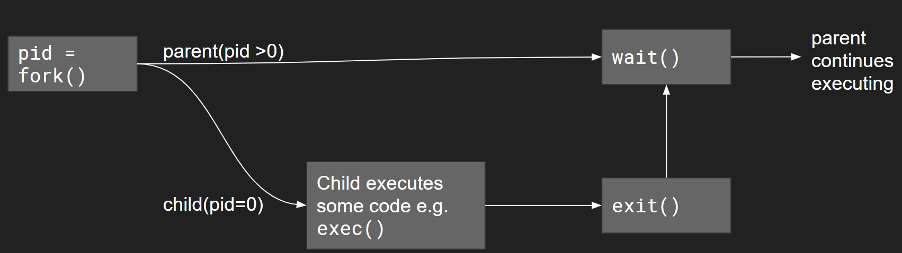

# The Process API

**Note: There's a checklist quiz on Canvas for this lab: <https://northeastern.instructure.com/courses/119197/quizzes/451503>**

In this lab, we are going to explore the C process API to get familiar with launching processes from within our program. Provided in this lab are several code examples showcasing several ways to launch and control processes. Today's lab will introduce you to 'multiprocessing' and some of the problems that can come along with it.

While submissions for this lab are individual, feel free to partner up for work and discussion.

---

###  **Read this before continuing**


For this lab, do not work on `login.khoury.northeastern.edu`. Instead, click [this link](https://www.random.org/integers/?num=1&min=30&max=70&col=1&base=10&format=html&rnd=new) and note down the 2-digit number you get. Then ssh into `vdi-linux-0XX.khoury.northeastern.edu`, where you replace `XX` with the number you got in the step above. Use this host name for the remainder of the lab. **You need to be on campus or in the Northeastern VPN to be able to log into these machines.** Alternatively, you can also first ssh to `login.khoury.northeastern.edu` then ssh from there to `vdi-linux-0XX.khoury.northeastern.edu`, like this:
```
$ ssh fvesely@login.khoury.northeastern.edu
Last login: ... 
=================================================================
You have logged into login-students.khoury.northeastern.edu
...
-bash-4.2$ ssh fvesely@vdi-linux-042.khoury.northeastern.edu
fvesely@vdi-linux-042.khoury.northeastern.edu's password: 
Last login: ... 
==================================================================================
If you have problems with this system, please report them to <systems@ccs.neu.edu>.
==================================================================================
Files saved to your home directory are saved on a Network drive accessible from
any of the Khoury machines, and is backed up.
==================================================================================
-bash-4.2$
```

---

<!-- **Work in your VM for this lab.**  Do not use Khoury login or Khoury VDI nodes for the lab. -->

## Fork and Exec Motivation

The `fork` system call serves as a simple way to create new processes. We are making an almost exact duplicate copy of the current running process (You can almost 'visualize' this as cell division). Again, the fork command creates a parent-child relationship. When we `exec` from that child process, the `exec` call replaces that current program by loading up (or overlaying) a new process (thus we no longer have a duplicate process). When thinking about this from the perspective of an operating system, fork is a quick way to create a new process, and 'exec' allows us to execute a totally new program in a separate address space safely (thus, not effecting our original parent process in case the child crashes).

# Part 1 - fork

Remember that when we use [fork](http://man7.org/linux/man-pages/man2/fork.2.html), we are creating a child process that is identical to the parent process. You can think of the child process getting a copy of (almost) everything that the parent had, but the memory is distinct, such that modifications in either the parent or child do not effect each other. The story is a little more complicated than that, but it's a good mental model.

Let us go ahead and try a simple example with `fork`.

### example1.c

The following program is our version of a "hello world" to the fork command you should enter in [example1.c](./example1.c).

```c
#include <stdio.h>
#include <sys/types.h>  // Includes some new data types (e.g. pid_t)
#include <unistd.h>  // This is a new library that includes various unix system calls.

int main(int argc, char **argv) {

  pid_t pid;
  int x = 1;

  // pid returns the child process id.
  // 0 if it is the child
  // >0 is the process id of the child which the parent recieves
  pid = fork();

  if (pid == 0) {
    printf("child: x = %d\n", ++x);
    return 0;  
  }

  // Parent
  printf("parent: x = %d\n", --x);

  return 0;
}
```

* Save and compile the code: `gcc -std=c11 example1.c -o example1`
* **Before running:** Predict with your partner what the result will be.
* Run the following program with: `./example1`

Let's try another example this time:

### example2.c

Type the following in [example2.c](./example2.c)

```c
#include <stdio.h>
#include <stdlib.h>
#include <sys/types.h>
#include <unistd.h>

int main(int argc, char **argv) {

  pid_t pid;
  int x = 1;

  // pid returns the child process id.
  // 0 if it is the child
  // >0 is the process id of the child which the parent recieves
  pid = fork();

  if (pid == 0) {
    printf("Terminating Child, pid = %d\n",getpid());
    exit(0);  
  } 
  else {
    // Run the parent
    printf("Running parent forever (pretend I am a server): pid = %d\n",getpid());
    while (1) {
    }
  }

  return 0;
}
```

* Save and compile the code: `gcc -std=c11 example2.c -o example2`
* Run the following program: `./example2 &`
* **Discuss with your partner** What happens when you compile and run this code? 
  * (When running with `./example2 &` the ampersand returns control back to shell and your process runs in the background until completion).

Type `ps -uf` into the terminal (or try `ps -ef | grep defunct`). You will notice that one of the processes is labeled `<defunct>`, and that id will actually match our child's PID. What happened here, is that we have not reclaimed (or reaped) our children. Our child is said to be a zombie process, in that it is occupying and using resources, but not doing any useful work.

Let us get rid of our processes now. Type `kill somenumber` where somenumber is the pid (process id) of your parent and child process (Note: that killing the parent process should kill the child process as well. See the [kill](http://man7.org/linux/man-pages/man2/kill.2.html) system call. Kill sends a signal to terminate a process.).
  
Now what if we flip the scenario where our child runs forever?

### example3.c

Type the following in [example3.c](./example3.c)

```c
#include <stdio.h>
#include <stdlib.h>
#include <sys/types.h>
#include <unistd.h>

int main(int argc, char **argv) {

  pid_t pid;
  int x = 1;

  // pid returns the child process id.
  // 0 if it is the child
  // >0 is the process id of the child which the parent recieves
  pid = fork();

  if (pid == 0) {
    printf("Running child forever now pid = %d\n",getpid());
    while (1) {
    }
  }
  else {
    // Run the parrent
    printf("Terminating parent pid = %d\n", getpid());
    exit(0);
  }

  return 0;
}
```

* Save and compile the code: `gcc -std=c11 example3.c -o example3`
* Run the following program: `./example3 &`

We will have the same problem, and we need to run the `ps -uf` command again (to see which processes are running), and then the `kill <some_pid_number>` command.

## Synchronization

There is a sometimes subtle problem you may have noticed in the previous example if you ran it enough times. We did not  enforce the order in which each process executed. So what is one potential solution to fix this problem?

The answer is to use a synchronization function called `wait`. `int wait(int *child_status)` will make the parent wait to execute after one or more child process(es) has finished.



### example4.c - Introducing wait

Type the following in [example4.c](./example4.c)

```c
#include <stdio.h>
#include <stdlib.h>
#include <sys/types.h>
#include <sys/wait.h> // Library with the 'wait' system call.
#include <unistd.h>

int main(int argc, char **argv) {

  // Store the status here
  int child_status;

  // Another way to 'fork()' a child process without storing the pid
  // The parent process will begin executing from the else block.
  if (fork() == 0) {
    printf("Child runs!\n");
    exit(0); // and exits properly
  } 
  else {
    printf("Hello from parent\n");
    // Look at 'man wait' to uncover how child_status is used to hold the child's exit status 
    wait(&child_status);

    // If we want to do something with the child_status here is an example.
    // Typically we can wait(NULL), but the parent may want
    // to capture how the child exited (maybe it exited with some error code).
    // e.g. change 'exit(0)' to 'exit(5)' in the block of code executed by
    // the child.
    if (WIFEXITED(child_status)) {
      // if child exited normally, print its exit status
      printf("Child exited with the following child_status %d\n", WEXITSTATUS(child_status));
    }
    printf("Child always is terminated by this point--parent resuming\n");
  }

    printf("This always prints last\n");

    // It is important to note that our parent should always wait for all
    // of its child processes to exit before proceeding.
    // If the parent ends first(i.e. forgetting to call wait), the
    // child process is 'orphaned' and becomes a zombie process that
    // cannot be otherwise terminated.

    return 0;
}
```

* Save and compile the code: `gcc -std=c11 example4.c -o example4`
* Run the following program: `./example4`
* Take a moment to read about orphan and zombie processes here: 
  * http://linuxg.net/what-are-zombie-and-orphan-processes-and-how-to-kill-them/
  * Understand what we saw in example 2 and 3 we created a zombie and orphan.
  * Understand also how to find and kill any zombie and orphan processes.
  
### example5.c - Introducing exec


#### execve

Sometimes we will want to not just launch a new piece of code, but rather execute an entire program as a separate process from within our process. We have been previously doing this using our terminal. In order to execute other programs (i.e. a more specific process), we have the [execve](http://man7.org/linux/man-pages/man2/execve.2.html) command.

- The execve command: `int execve(char* filename, char* argv[], char*envp[])`
- filename: This is the script or file we are going to execute (i.e. this is equivalent to typing it in the shell)
- argv: This is our argument list (which we are familiar with). 
  - As an example: argv[0] = filename of the program we want to execute
- envp: These are any specific environment variables we want to set.
  - More information can be found here: [https://en.wikipedia.org/wiki/Environment_variable]

Let's try a simple example using execve to launch the 'ls' program from within our program.

Type the following in [example5.c](./example5.c)

```c
#include <stdio.h>
#include <stdlib.h>
#include <sys/types.h>
#include <sys/wait.h>
#include <unistd.h>

int main(int argc, char **argv) {

  char* myargv[16];      // We can store up to 16 arguments.
  myargv[0] = "/bin/ls"; // Our first argument is the program we want to launch.
  myargv[1] = "-F";      // Any additional arguments (i.e. flags) we want to make use of.
  myargv[2] = NULL;      // Terminate the argument list--similar to how we would terminate a character string.
                         // (i.e. Set the last argument to NULL if we have no more flags.)
  if (fork() == 0) {
    // Executes command from child then terminates our process
    // Note: There are other 'exec' functions that may be helpful. Look at 'man exec' and 'man execve'.
    execve(myargv[0], myargv, NULL);
    printf("Child: Should never get here\n");
    exit(1);
  }
  else {
    wait(NULL); // handy synchronization function again!
    printf("This always prints last\n");
  }
  
  return 0;
}
```

* Save and compile the code: `gcc -std=c11 example5.c -o example5`
* Run the following program: `./example5`
* Go ahead and modify the above code and try to run some other processes like 'cat'.
* **Discuss and try with your partner:** Will the code work if I change `myargv[0] = "ls"`. Why do you think this is? What did you discover?
  * Some hints to the previous question
    * https://phoenixts.com/blog/environment-variables-in-linux/ 
    * https://www.cyberciti.biz/faq/linux-list-all-environment-variables-env-command/


# Programming Task - myprogram.c

Now that you have learned how to use fork(), exec(), and wait() you will write your own program utilizing these system calls.

### Task

- Write a program in [myprogram.c](./myprogram.c) using fork and/or execve to execute a series of at least 3 other commands/programs.
  - Your program should run: `ps -uf`, followed by `echo --help`, and then `nl -b a example1.c`
  - [example5.c](./example5.c) is a program that executes exactly 1 command, and you may expand on this example in your [myprogram.c](./myprogram.c)
  - You are welcome to launch a different set of programs AFTER launching the first 3.  Be as creative as you like!
  - It may be useful to use [waitpid](https://linux.die.net/man/2/waitpid) if you'd like to wait on a specific process to execute (think about if the order matters however!)

# Part 2 - Terminal Programs

To get some practice with understanding processes, run the following commands: 

- `ls proc/` (Why use 'ls' here? What happens if you just type `/proc`)
- [top](http://man7.org/linux/man-pages/man1/top.1.html)
- [ps](https://man7.org/linux/man-pages/man1/ps.1.html)
- [kill](http://man7.org/linux/man-pages/man2/kill.2.html) 

It will be further useful to read the `man` pages for each of the commands.

# Lab Deliverable

1. Make sure you complete all the steps on the [Lab 5 Quiz](https://northeastern.instructure.com/courses/99572/quizzes/410429) checklist.
2. Commit the source code for the 5 examples (`example1.c`, `example2.c`, `example3.c`, `example4.c`, `example5.c`).
3. Commit your source code for [myprogram.c](./myprogram.c)
4. Upload your repo to Gradescope


# More resources to help

- <https://www.networkworld.com/article/2693548/unix-viewing-your-processes-through-the-eyes-of-proc.html>
- Stack overflow post on `kill` system call.
  - <https://unix.stackexchange.com/questions/8916/when-should-i-not-kill-9-a-process>
- On Interprocess Communication (i.e. pipe)
  - <https://www.usna.edu/Users/cs/aviv/classes/ic221/s16/lec/18/lec.html>
- Another useful tutorial on pipe, fork, etc.
  - <http://www.rozmichelle.com/pipes-forks-dups/>
  
# Going Further

- Investigate the different command shells: <https://en.wikipedia.org/wiki/Comparison_of_command_shells>

# F.A.Q.

## Difference between Zombie Process, Orphaned Process and Daemon Process

* Zombie Process - a zombie process (same as `defunct`) is a process that has completed execution but still has an entry in the process table and this happens when the termination of the process has not been collected by the parent (example2.c)
* Orphaned Process - process whose parent process has finished or terminated, though it remains running itself. (example3.c)
* Daemon Process - Daemon is a computer program that runs as a background process, every daemon process is an orphaned process.

